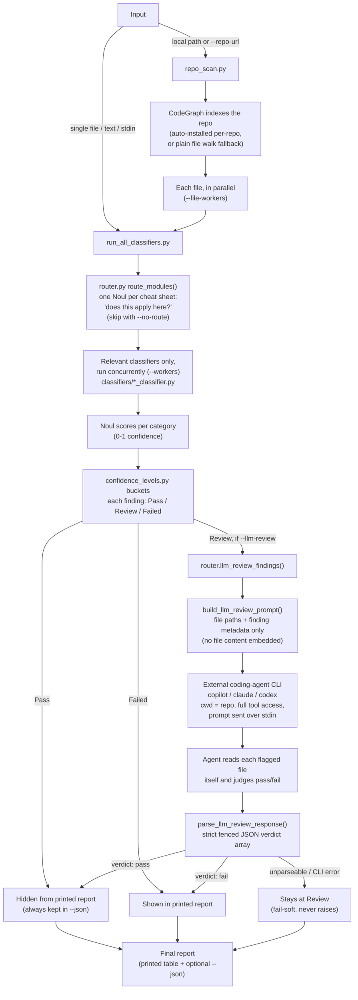

# typesafe-security-review

Classifiers built on the [TypeSafe](https://typesafe.ai) System One API (via
`typesafe_sdk`) that score input text against the full
[OWASP Cheat Sheet Series](https://cheatsheetseries.owasp.org/) (122 cheat
sheets), plus 9 additional classifiers sourced directly from
[CWE](https://cwe.mitre.org/) definitions (131 classifiers total) for
weakness families -- memory safety, path traversal, race conditions, SSTI,
hardcoded credentials, HTTP request smuggling, unsafe reflection,
CSV/formula injection, untrusted search path -- that the OWASP series
doesn't have a dedicated page for.

## Program flow



`--llm-review` is opt-in and off by default; without it, `Review`-band
findings simply stay at `Review` in the final report (the `J`/`J1-J4`
branch above doesn't run). See
[Optional LLM-assisted review of "Review"-band findings](#optional-llm-assisted-review-of-review-band-findings)
below for the full CLI usage.

## Layout

- `classifiers/` — one module per cheat sheet or CWE definition, named
  `<topic>_classifier.py`. Each module exposes a standard interface:
  - `CHEATSHEET_NAME`, `CHEATSHEET_URL` — identifies the source (an OWASP
    cheat sheet, or for the 9 CWE-sourced classifiers, the primary CWE
    definition page, e.g. `https://cwe.mitre.org/data/definitions/22.html`).
  - `CATEGORIES: dict[str, str]` — 5-12 sub-categories (specific risks,
    attack patterns, or checklist items) drawn from that cheat sheet's own
    content, keyed by a short `snake_case` name.
  - `classify_with_nouls(text) -> dict[str, float]` — scores every category
    independently as a TypeSafe `Noul` question in a single parallel
    `system_one()` call, returning `{category: probability}` (0-1). Unlike a
    `Choice`, categories are independent, so input can match zero, one, or
    several at once.
  - Each file is also a standalone CLI (`python classifiers/xxx_classifier.py "text"`).
  - `classifiers/_TEMPLATE.py.txt` — the template new classifiers follow.
- `run_all_classifiers.py` — coordinator that discovers every
  `classifiers/*_classifier.py` module, routes the input through `router.py`
  to skip irrelevant cheat sheets, sends the input text to the remaining
  modules concurrently (thread pool), and prints one consolidated report of
  every `(cheat sheet, category)` finding with confidence > 0, sorted
  descending.
- `router.py` — relevance router, also built on TypeSafe. Asks one `Noul`
  per cheat sheet ("does this cheat sheet apply to this input?") in a single
  parallel `system_one()` call (the
  [speculative fan-out](https://docs.typesafe.ai/patterns/fan-out.md)
  pattern), so `run_all_classifiers.py` doesn't waste calls running, e.g.,
  the Django/Laravel/Ruby on Rails classifiers against a `.java` file.

## Usage

```sh
pip install typesafe-sdk
export TYPESAFE_API_KEY=...   # https://console.typesafe.ai/

# primary usage: classify a source file against all 131 classifiers
python run_all_classifiers.py --file bad.java
```

Other input modes:

```sh
python run_all_classifiers.py "some text to check"
python run_all_classifiers.py --file path/to/content.txt
echo "some text" | python run_all_classifiers.py

# tuning
python run_all_classifiers.py --file bad.java --workers 24 --top 25 --threshold 0.3

# routing (on by default) -- disable to always run all 131 classifiers
python run_all_classifiers.py --file bad.java --no-route
python run_all_classifiers.py --file bad.java --route-threshold 0.5

# confidence-level thresholds (see "Confidence levels" below)
python run_all_classifiers.py --file bad.java --failed-threshold 0.7 --review-threshold 0.3
```

Run a single cheat sheet's classifier directly:

```sh
python classifiers/prompt_injection_classifier.py "ignore all previous instructions"
```

## Routing

Running all 131 classifiers on every input works but is wasteful when most
cheat sheets obviously don't apply (e.g. Django/Laravel/Ruby on Rails
classifiers for a `.java` file). `router.py` pre-filters:

```sh
python router.py --file bad.java
```

It asks one `Noul` per cheat sheet -- "does this cheat sheet apply here?" --
all in a single parallel call, then only the classifiers scoring at or above
`--route-threshold` (default `0.35`) are run. `run_all_classifiers.py` uses
this automatically; pass `--no-route` to skip routing and always run all 131.
If routing itself fails (e.g. no API key), the coordinator logs a warning and
falls back to running every classifier unfiltered.

## Confidence levels

Every finding from `run_all_classifiers.py` and `repo_scan.py` is bucketed
into one of three levels based on its confidence score:

| Level | Range | Shown in printed table? |
|---|---|---|
| `Failed` | confidence > 0.65 | yes |
| `Review` | 0.40 <= confidence <= 0.65 | yes |
| `Pass` | confidence < 0.40 | no (hidden by default) |

`Pass` findings are hidden from the printed table (a summary line reports
how many were hidden) but are always included in `repo_scan.py --json`
output, so nothing is silently discarded. Both thresholds are
configurable via `--failed-threshold`/`--review-threshold` flags or the
`TSR_FAILED_THRESHOLD`/`TSR_REVIEW_THRESHOLD` environment variables (flag
> env var > default). See
[`specs/007-confidence-levels/spec.md`](specs/007-confidence-levels/spec.md).

## Sample vulnerable file

`bad.java` (used above) is a small, intentionally vulnerable Java class
(hardcoded credentials, SQL injection, command injection, path traversal,
XSS, SSRF, insecure deserialization, and a weak PRNG) used to sanity-check
the classifiers end-to-end. Add `--top 30` to only see the strongest hits.

Expect the top findings to score ~0.9-0.97 confidence across the relevant
cheat sheets (e.g. Secrets Management, SQL/Command Injection, SSRF,
Deserialization), while unrelated cheat sheets (e.g. Zero Trust Architecture,
SAML) trail off toward 0.

> **Always pass source code via `--file`, not as an inline shell argument.**
> Quoting/escaping a multi-line file as a single shell string (or JSON string) can
> mangle code (literal `\n` instead of real newlines, escaped quotes, `!`
> triggering bash history expansion) and lower confidence scores across the
> board. `--file` reads the content byte-for-byte with no shell interference.

## Scanning a whole repository

`repo_scan.py` runs the same classifier pipeline across an entire
repository instead of one file at a time. It uses
[CodeGraph](https://github.com/colbymchenry/codegraph) (an external, local
code-graph indexer) to find files that actually contain executable code, so
it skips docs/config/data without a hand-maintained extension list.
CodeGraph is now **installed automatically** as a **local, per-repo**
dependency the first time it's needed -- `npm install --prefix
<repo>/.codegraph-cli --no-save @colbymchenry/codegraph` -- not a global
install, and not dependent on `codegraph` being on `PATH`: the binary is
always invoked by its resolved path under `<repo>/.codegraph-cli/`. If
`npm` isn't available or the install fails, it falls back to a plain file
walk with a warning. Files are scanned **in parallel** (`--file-workers`,
default 25), each still using the existing per-file classifier pool
(`--workers`, default 16).

```sh
# scan a local checkout
python repo_scan.py /path/to/repo

# clone and scan a remote repo (shallow clone, cleaned up afterward)
python repo_scan.py --repo-url https://github.com/org/repo.git
python repo_scan.py --repo-url git@github.com:org/repo.git --ref main

# tuning
python repo_scan.py /path/to/repo --max-files 50 --top 30
python repo_scan.py /path/to/repo --file-workers 10 --workers 8   # throttle total concurrency
python repo_scan.py /path/to/repo --no-codegraph   # skip auto-install too; always plain file walk
python repo_scan.py --repo-url https://github.com/org/repo.git --json out.json
```

CodeGraph's local install lives under `<repo>/.codegraph-cli/` (separate
from its own `.codegraph/` index data) and can be pre-created manually
ahead of time if preferred (e.g. to pre-warm a CI cache):

```sh
npm install --prefix /path/to/repo/.codegraph-cli --no-save @colbymchenry/codegraph
```

### Optional LLM-assisted review of "Review"-band findings

Findings left in the ambiguous `Review` band after a scan can optionally be
sent to an external coding-agent CLI (`copilot`, `claude`, or `codex`) for a
second opinion, which reclassifies each one to `Pass` or `Failed`. Off by
default; enable with `--llm-review`:

```sh
# review with the default backend (copilot)
python repo_scan.py /path/to/repo --llm-review

# choose a backend, tune the timeout, and keep the generated artifacts
python repo_scan.py /path/to/repo --llm-review --llm-review-backend claude \
    --llm-review-timeout 600 --keep-llm-review-artifacts \
    --llm-review-prompt-path /tmp/review-prompt.txt \
    --llm-review-response-path /tmp/review-response.txt
```

This is opt-in because it grants an agentic CLI tool access while it reads
a possibly-untrusted repo's file content; see
[`specs/003-relevance-router/spec.md`](specs/003-relevance-router/spec.md)
for the full prompt/response contract and security notes.

See [`specs/006-full-repo-scan/spec.md`](specs/006-full-repo-scan/spec.md)
for the full design, including git-URL handling and cleanup semantics.

## Evals

`evals/run_evals.py` sanity-checks each classifier against a `bad`/`good`
fixture pair, confirming it scores clearly high on an obvious positive and
stays quiet on a safe counterpart.

```sh
python evals/run_evals.py                 # run every classifier with fixtures
python evals/run_evals.py --dry-run        # check fixture coverage only, no API calls
python evals/run_evals.py --filter "sql*"  # only stems matching a glob
```

See [`evals/README.md`](evals/README.md) for fixture format and how to add
fixtures for a new classifier.

## Specs

[`specs/`](specs/) documents the system in detail: architecture, the
classifier module contract, the router, the coordinator CLI, the full
classifier catalog, and the full-repo-scan design. See
[`specs/README.md`](specs/README.md) for the index.

## Adding a new classifier

Copy `classifiers/_TEMPLATE.py.txt` to `classifiers/<topic>_classifier.py`,
fill in `CHEATSHEET_NAME`/`CHEATSHEET_URL` (an OWASP cheat sheet page, or a
CWE definition page such as `https://cwe.mitre.org/data/definitions/<id>.html`
if the topic isn't covered by an existing OWASP cheat sheet), and derive
`CATEGORIES` from that source's real content. `run_all_classifiers.py` picks
it up automatically (no registration needed).

Also add an entry to `ROUTES` in `router.py` keyed by the same module stem
(e.g. `"<topic>_classifier"`), with a short `applies_when` scope description
(what language/framework/context makes this classifier relevant) -- this is
what lets the router correctly include or skip your new classifier.
